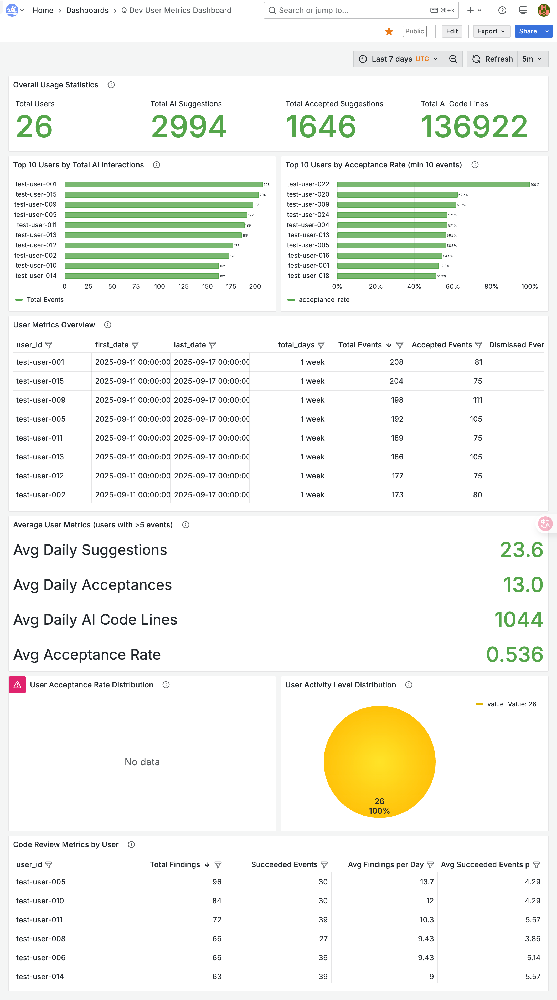
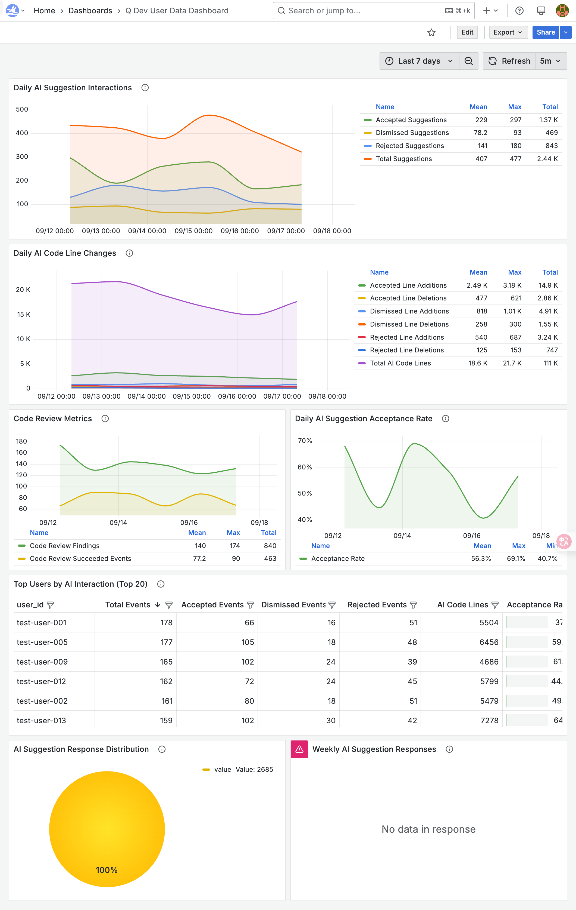

# Apache DevLake 对接 Amazon Q Developer 完整指南

[[更新版本github](https://github.com/liangyimingcom/Apache-DevLake-integrates-with-Amazon-Q-Developer-guide-and-third-party-platform-data-integration)]

## 📋 项目概述

本项目提供了在AWS平台上部署Apache DevLake并对接Amazon Q Developer的完整解决方案，包括详细的操作指南、代码示例、配置文件和故障排除方案。


## 📁 最终效果演示






### 图片来自Grafana仪表板

- **URL**: http://<EC2-PUBLIC-IP>:3000/d/qdev_user_metrics/q-dev-user-metrics-dashboard
- **数据源**: DevLake MySQL数据库
- **主要数据表**:
  - `_tool_q_dev_user_metrics` - 用户聚合指标
  - `_tool_q_dev_user_data` - 用户日常数据

### 核心指标字段

```sql
-- 用户聚合指标表 (_tool_q_dev_user_metrics)
- user_id, display_name                    -- 用户标识
- first_date, last_date, total_days        -- 时间范围
- total_inline_suggestions_count           -- 总建议数
- total_inline_acceptance_count            -- 总接受数
- acceptance_rate                          -- 接受率
- total_inline_ai_code_lines              -- AI生成代码行数
- total_code_review_findings_count         -- 代码审查发现数
- avg_* 字段                              -- 各种平均值

-- 用户日常数据表 (_tool_q_dev_user_data)
- user_id, display_name, date             -- 用户和日期
- inline_suggestions_count                -- 日建议数
- inline_acceptance_count                 -- 日接受数
- chat_messages_sent                      -- 聊天消息数
- code_fix_generation_event_count         -- 代码修复生成事件
- test_generation_event_count             -- 测试生成事件
```

## 

### 🎯 主要功能

- ✅ AWS EC2上的DevLake一键部署
- ✅ Amazon Q Developer数据源配置
- ✅ Q Dev用户指标数据收集和可视化
- ✅ 多种第三方平台数据集成方案
- ✅ 完整的故障排除和问题修复指南

## 📁 项目结构

```
├── Apache DevLake 对接 Amazon Q Developer 指南与第三方平台数据集成.md  # 主文档
├── README.md                                                      # 项目说明
├── code-examples/                                                 # 代码示例
│   ├── database-access/                                          # 数据库直接访问
│   │   ├── qdev_database_demo.py                                # 数据库访问Demo
│   │   ├── solution1-database-access-demo.md                   # 方案1详细说明
│   │   └── requirements.txt                                     # Python依赖
│   ├── api-integration/                                         # API集成
│   │   └── devlake_api_client.py                               # DevLake API客户端
│   └── data-export/                                             # 数据导出
│       └── json_exporter.py                                    # JSON导出器
├── configs/                                                      # 配置文件
│   ├── docker/
│   │   └── docker-compose.yml                                  # Docker Compose配置
│   └── aws/
│       └── security-group-rules.json                           # AWS安全组配置
├── scripts/                                                     # 自动化脚本
│   ├── deploy-devlake.sh                                       # 一键部署脚本
│   └── health-check.sh                                         # 健康检查脚本
├── troubleshooting/                                             # 故障排除
│   ├── devlake-500-error/
│   │   └── README.md                                           # 500错误解决方案
│   └── config-ui-issues/
│       └── README.md                                           # Config UI问题解决
└── docs/                                                        # 补充文档
    ├── create-q-dev-connection.md                              # Q Dev连接创建
    └── grafana-data-integration-solutions.md                   # 数据集成方案
```

## 🚀 快速开始

### 1. 环境准备
- AWS账户和适当权限
- EC2实例 (推荐t3.large或更高配置)
- 基本的Linux命令行操作能力

### 2. 一键部署
```bash
# 下载部署脚本
wget https://raw.githubusercontent.com/your-repo/deploy-devlake.sh

# 运行部署脚本
chmod +x deploy-devlake.sh
./deploy-devlake.sh
```

### 3. 访问服务
部署完成后，可以通过以下地址访问：
- **Config UI**: http://YOUR-EC2-IP:4000
- **DevLake API**: http://YOUR-EC2-IP:8080
- **Grafana**: http://YOUR-EC2-IP:3000 (admin/admin)

## 📖 详细文档

### 主要文档
- [**完整部署指南**](Apache%20DevLake%20对接%20Amazon%20Q%20Developer%20指南与第三方平台数据集成.md) - 详细的步骤说明和配置指南

### 代码示例
- [**数据库直接访问**](code-examples/database-access/) - 最简单的数据集成方案
- [**API集成**](code-examples/api-integration/) - 标准化的API接口方案
- [**数据导出**](code-examples/data-export/) - 批量数据导出方案

### 故障排除
- [**DevLake 500错误**](troubleshooting/devlake-500-error/) - 常见500错误的解决方案
- [**Config UI问题**](troubleshooting/config-ui-issues/) - Config UI访问问题解决

## 🛠️ 数据集成方案

### 方案对比

| 方案 | 复杂度 | 实时性 | 数据一致性 | 适用场景 |
|------|--------|--------|------------|----------|
| 直接数据库访问 | ⭐ | ⭐⭐⭐⭐⭐ | ⭐⭐⭐⭐⭐ | [⭐推荐使用]内部系统，实时需求 |
| ~~DevLake API~~ | ~~⭐⭐~~ | ~~⭐⭐⭐⭐~~ | ~~⭐⭐⭐⭐~~ | ~~标准集成，推荐~~ |
| ~~Grafana API~~ | ~~⭐⭐⭐~~ | ~~⭐⭐⭐~~ | ~~⭐⭐⭐~~ | ~~复用现有配置~~ |
| ~~文件导出~~ | ~~⭐⭐~~ | ~~⭐~~ | ~~⭐⭐⭐⭐~~ | ~~批处理，离线分析~~ |
| ~~实时数据流~~ | ~~⭐⭐⭐⭐⭐~~ | ~~⭐⭐⭐⭐⭐~~ | ~~⭐⭐⭐⭐~~ | ~~大规模实时系统~~ |

### 推荐实施路径
1. **阶段1**: 使用直接数据库访问快速验证
2. **阶段2**: 实施DevLake API标准集成
3. **阶段3**: 根据需求选择高级特性

## 🔧 使用示例

### 数据库直接访问
```python
from qdev_database_demo import QDevMetricsDB

# 初始化数据库连接
db = QDevMetricsDB(host='YOUR-EC2-IP')

# 获取用户指标
metrics = db.get_user_metrics_summary()
print(f"找到 {len(metrics)} 个用户")

# 导出数据
export_file = db.export_to_json('my_metrics.json')
print(f"数据已导出到: {export_file}")
```

### API集成
```python
from devlake_api_client import DevLakeAPIClient, QDevMetricsAPI

# 初始化API客户端
client = DevLakeAPIClient("http://YOUR-EC2-IP:8080")
qdev_api = QDevMetricsAPI(client)

# 创建Q Dev连接
config = {
    "name": "my_qdev_connection",
    "accessKeyId": "YOUR_ACCESS_KEY",
    "secretAccessKey": "YOUR_SECRET_KEY",
    "region": "us-east-1",
    "bucket": "your-bucket-name"
}

connection = qdev_api.setup_q_dev_connection(config)
print(f"连接已创建: {connection['id']}")
```

## 🔍 故障排除

### 常见问题

#### 1. DevLake 500错误（DevLake服务依赖MySQL数据库，如果MySQL未完全启动就启动DevLake，会导致连接失败）
**症状**: Config UI返回HTTP 500错误
**解决**: 

```bash
# 重启DevLake服务
cd /opt/devlake
docker-compose restart devlake

# 修复nginx配置
docker exec devlake_config-ui_1 nginx -s reload
```

#### 2. Config UI无法访问
**症状**: 无法连接到端口4000
**解决**: 
```bash
# 检查安全组配置
aws ec2 describe-security-groups --group-ids YOUR-SG-ID

# 添加当前IP访问权限
aws ec2 authorize-security-group-ingress \
  --group-id YOUR-SG-ID \
  --protocol tcp --port 4000 \
  --cidr $(curl -s ifconfig.me)/32
```

#### 3. 数据库连接失败
**症状**: 无法连接MySQL数据库
**解决**:
```bash
# 检查MySQL服务状态
docker-compose ps mysql

# 重启MySQL服务
docker-compose restart mysql
```

### 自动化检查
```bash
# 运行健康检查脚本
./scripts/health-check.sh

# 查看详细状态
docker-compose ps
docker-compose logs
```

## 📊 数据结构

### 主要数据表

#### 用户聚合指标表 (`_tool_q_dev_user_metrics`)
```sql
user_id                              -- 用户唯一标识
display_name                         -- 用户显示名称
total_inline_suggestions_count       -- 总代码建议数
total_inline_acceptance_count        -- 总接受数
acceptance_rate                      -- 接受率
total_inline_ai_code_lines          -- AI生成代码总行数
```

#### 用户日常数据表 (`_tool_q_dev_user_data`)
```sql
user_id                              -- 用户唯一标识
date                                 -- 数据日期
inline_suggestions_count             -- 当日建议数
inline_acceptance_count              -- 当日接受数
chat_messages_sent                   -- 聊天消息数
```

## 📞 技术支持

### 获取帮助
1. 查看[故障排除文档](troubleshooting/)
2. 运行健康检查脚本
3. 查看相关日志文件
4. 联系技术支持团队

### 相关资源
- [Apache DevLake官方文档](https://devlake.apache.org/)
- [Amazon Q Developer文档](https://docs.aws.amazon.com/amazonq/)
- [Docker Compose文档](https://docs.docker.com/compose/)

## 📄 许可证

本项目采用MIT许可证，详见[LICENSE](LICENSE)文件。

## 🏷️ 版本信息

- **当前版本**: v2.0
- **最后更新**: 2025-09-17
- **兼容性**: Apache DevLake latest, Amazon Q Developer

---

**注意**: 本指南基于实际部署经验编写，包含了完整的操作步骤和问题解决方案。如果在使用过程中遇到问题，请参考相应的故障排除文档或联系技术支持。
